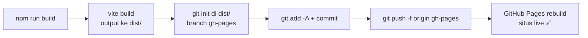

# 🚀 Panduan Deploy — GitHub Pages

Dokumentasi cara deploy portfolio ini ke GitHub Pages di **https://ilhamridho04.github.io/**

---

## 📌 Ringkasan Setup

| Item | Nilai |
|------|-------|
| Repository | `https://github.com/ilhamridho04/ilhamridho04.github.io.git` |
| Tipe repo | **User pages** (`<username>.github.io`) |
| Live URL | https://ilhamridho04.github.io/ |
| Branch `main` | Source code (React + Vite) |
| Branch `gh-pages` | Hasil build (output folder `dist/`) |
| Metode aktif | **Deploy from a branch** (`gh-pages`) |
| Metode alternatif | GitHub Actions (lihat [bawah](#-metode-2-github-actions-auto-deploy)) |

> Karena ini repo **user pages**, situs dilayani di root domain (`/`), jadi **tidak perlu** mengubah `base` di `vite.config.js`.

---

## ⚡ Deploy Cepat (Metode 1 — Direkomendasikan)

Satu perintah untuk build + push ke branch `gh-pages`:

```bash
npm run deploy
```

Selesai. Tunggu 1–2 menit, lalu cek https://ilhamridho04.github.io/

### Apa yang terjadi di balik layar?

Script `deploy` di `package.json` menjalankan langkah berikut secara berurutan:



1. **`vite build`** — compile React app ke folder `dist/`
2. **`git init` di dalam `dist/`** — bikin git repo sementara khusus untuk output build
3. **Commit semua file hasil build** ke branch `gh-pages`
4. **Force push** ke branch `gh-pages` di remote origin

> 💡 Folder `dist/` di-ignore oleh `.gitignore` di branch `main`, jadi repo sementara di dalamnya tidak mengganggu source code.

### Persyaratan sekali setup

Pastikan pengaturan GitHub Pages sudah benar (cukup sekali saja):

1. Buka **Settings → Pages** di repo:
   https://github.com/ilhamridho04/ilhamridho04.github.io/settings/pages
2. **Source** → pilih **Deploy from a branch**
3. **Branch** → pilih **`gh-pages`**, folder **`/(root)`**
4. Klik **Save**

---

## 🤖 Metode 2 — GitHub Actions (Auto Deploy)

Repo ini juga menyertakan workflow CI/CD di `.github/workflows/deploy.yml`.
Setiap push ke `main`, GitHub akan otomatis build dan deploy.

### Cara mengaktifkan

1. Buka **Settings → Pages**:
   https://github.com/ilhamridho04/ilhamridho04.github.io/settings/pages
2. **Source** → ganti ke **GitHub Actions**
3. Push apa saja ke `main` (atau klik **Run workflow** di tab Actions)

### Perbandingan kedua metode

| | Metode 1 (`npm run deploy`) | Metode 2 (Actions) |
|---|---|---|
| Perintah | Manual, 1 perintah | Otomatis saat push |
| Butuh internet di lokal | ✅ Ya (push) | ❌ Tidak |
| Butuh Actions sehat | ❌ Tidak | ✅ Ya |
| Riwayat deploy | Commit di `gh-pages` | Tab Actions |
| Cocok saat | Actions bermasalah/billing issue | Setup normal |

> ⚠️ **Catatan:** Jika akun GitHub terkena *billing issue*, job Actions tidak akan jalan dengan error:
> `"The job was not started because your account is locked due to a billing issue."`
> Solusinya perbaiki di https://github.com/settings/billing , atau pakai **Metode 1**.
> Jangan lupa kembalikan Source Pages ke **GitHub Actions** setelah billing beres.

---

## 🔧 Troubleshooting

### 1. Situs 404 setelah deploy

- Tunggu 1–2 menit, Pages butuh waktu untuk rebuild.
- Cek tab **Actions** atau **Settings → Pages** untuk status build terakhir.
- Pastikan branch yang dipilih di Settings → Pages adalah `gh-pages`.

### 2. Halaman blank putih / aset gagal load (404 pada `/assets/...`)

Ini terjadi kalau `base` Vite tidak cocok dengan path serving:

- **User pages** (`ilhamridho04.github.io`) → `base` default `'/'` ✅ (setup saat ini)
- **Project pages** (`username.github.io/nama-repo/`) → tambahkan di `vite.config.js`:

```js
export default defineConfig({
  base: '/nama-repo/',
  plugins: [react(), tailwindcss()],
})
```

### 3. Push ditolak (`! [rejected] ... fetch first`)

Script deploy memakai `git push -f` (force), jadi biasanya aman. Kalau tetap gagal:

```bash
cd dist && git push -f origin gh-pages
```

### 4. Error autentikasi saat push (`403`)

- Pastikan kamu login dengan akun yang punya akses push ke repo.
- Gunakan HTTPS + Personal Access Token (PAT), atau switch ke SSH:

```bash
git remote set-url origin git@github.com:ilhamridho04/ilhamridho04.github.io.git
```

### 5. Perubahan tidak muncul (cache browser)

Hard refresh dengan `Ctrl + Shift + R`, atau buka di incognito mode.

---

## ✅ Checklist Deploy

- [ ] Semua perubahan sudah di-commit & push ke `main`
- [ ] Jalankan `npm run deploy`
- [ ] tunggu 1–2 menit
- [ ] Cek https://ilhamridho04.github.io/
- [ ] Hard refresh (`Ctrl + Shift + R`) kalau masih tampil versi lama

---

## 📁 Struktur Terkait

```
portfolio/
├── .github/
│   └── workflows/
│       └── deploy.yml        # Workflow GitHub Actions (auto deploy)
├── dist/                     # Output build (di-gitignore, berisi .git sementara setelah deploy)
├── docs/
│   └── DEPLOY.md             # ← Dokumen ini
├── vite.config.js            # Konfigurasi Vite (base path, plugin)
└── package.json              # Script "deploy" ada di sini
```
